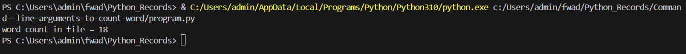

# Command--line-arguments-to-count-word
## AIM:
To write a python program for getting the word count from the contents of a file using command line arguments.
## EQUIPEMENT'S REQUIRED: 
PC
Anaconda - Python 3.7
## ALGORITHM: 
### Step 1:
Import sys module to use command line arguments.
### Step 2: 
 Create a file pointer and open the file which is passed in command line.
### Step 3: 
Initialize word count as zero.
### Step 4:  
For each line in file, split it into words and find number of the words in every line.
### Step 5: 
Sum the number of words in each line.
### Step 6: 
Display the total words in the file.
## PROGRAM:
```python
import sys
count1=0
with open(sys.argv[0],'r') as f1:
    for line in f1:
        word1=line.split()
        count1+=len(word1)
print('word count in file =',count1)

```
### OUTPUT:


## RESULT:
Thus the program is written to find the word count from the contents of a file using command line arguments.
